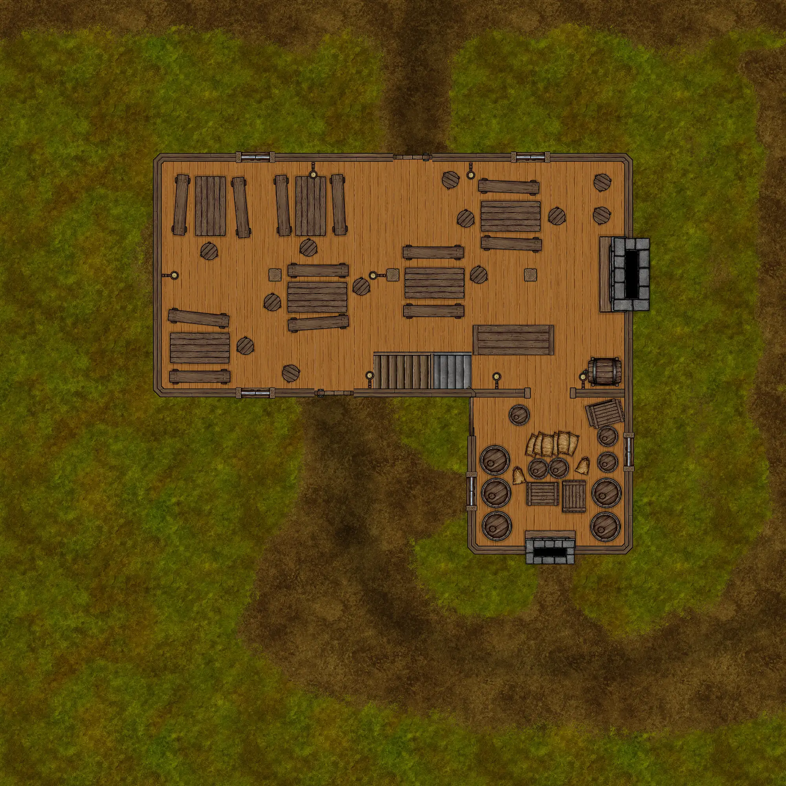
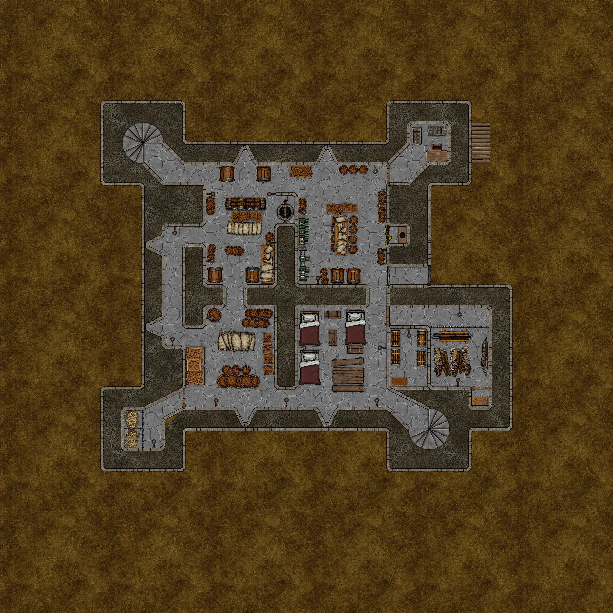
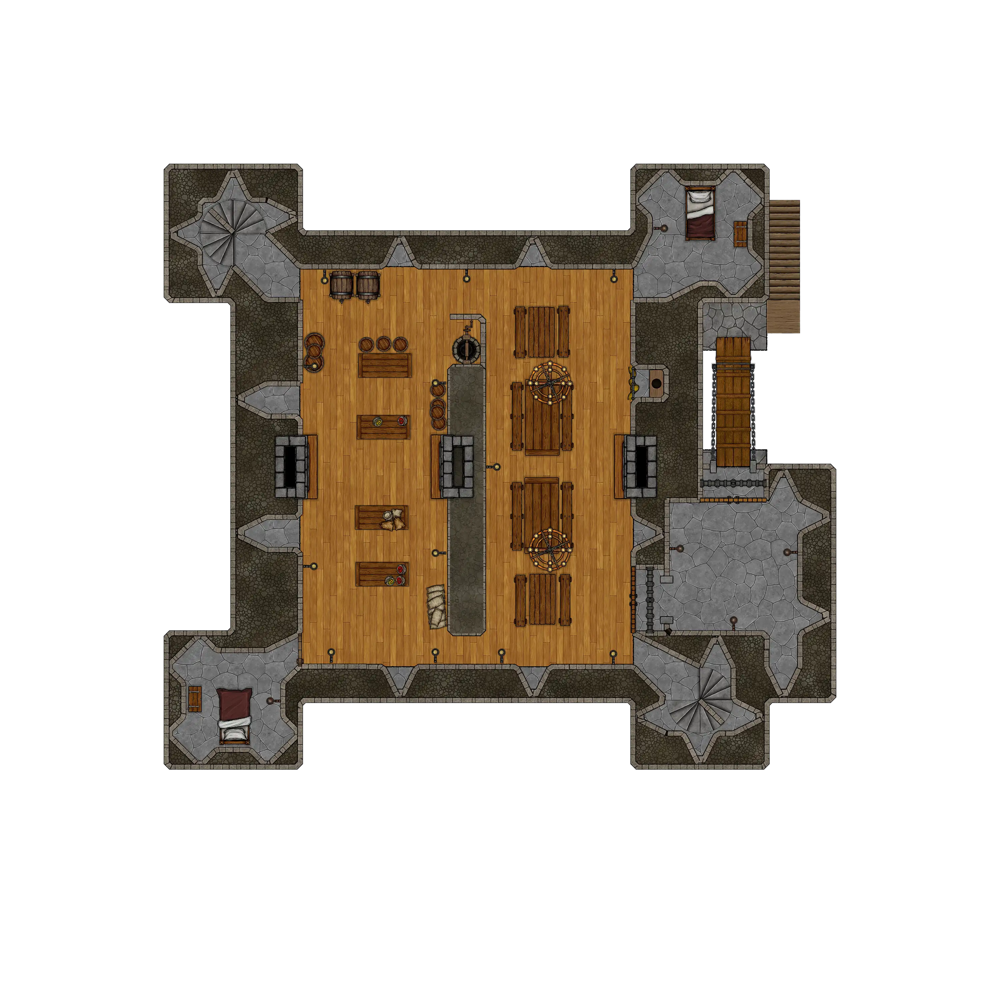
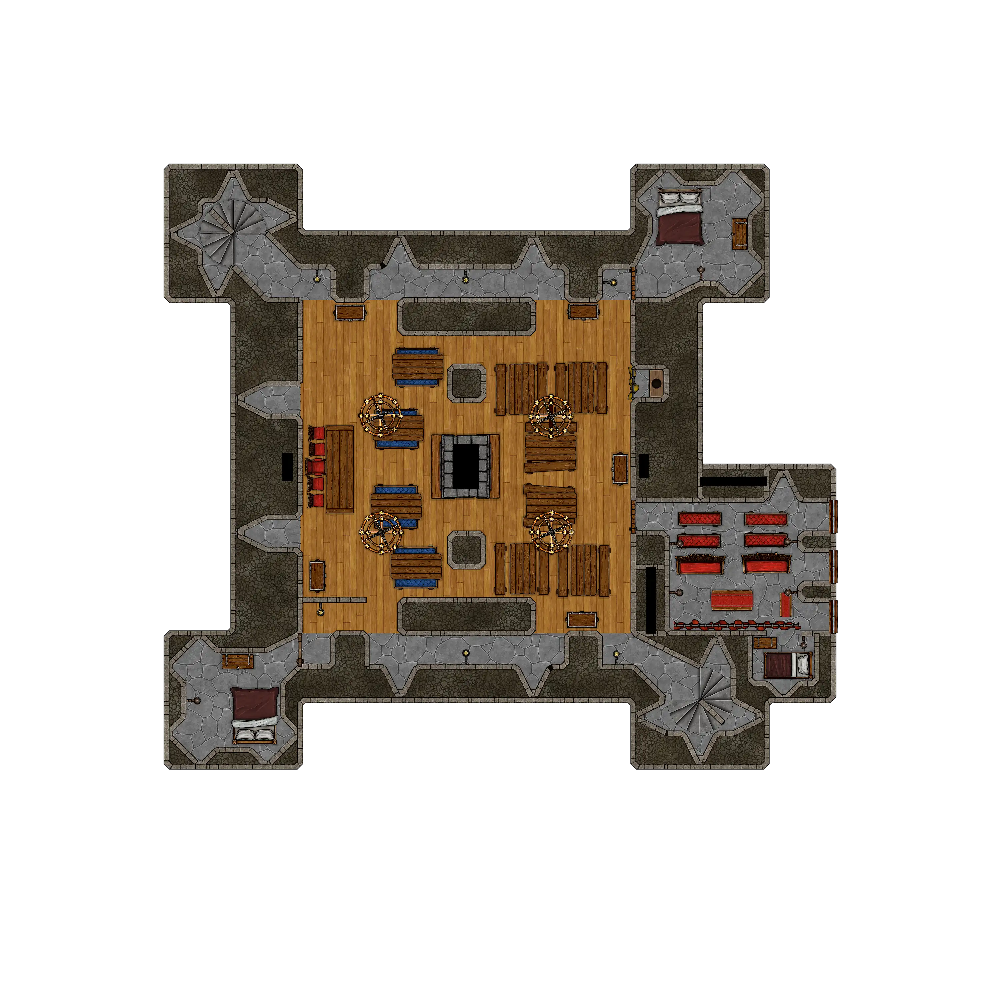
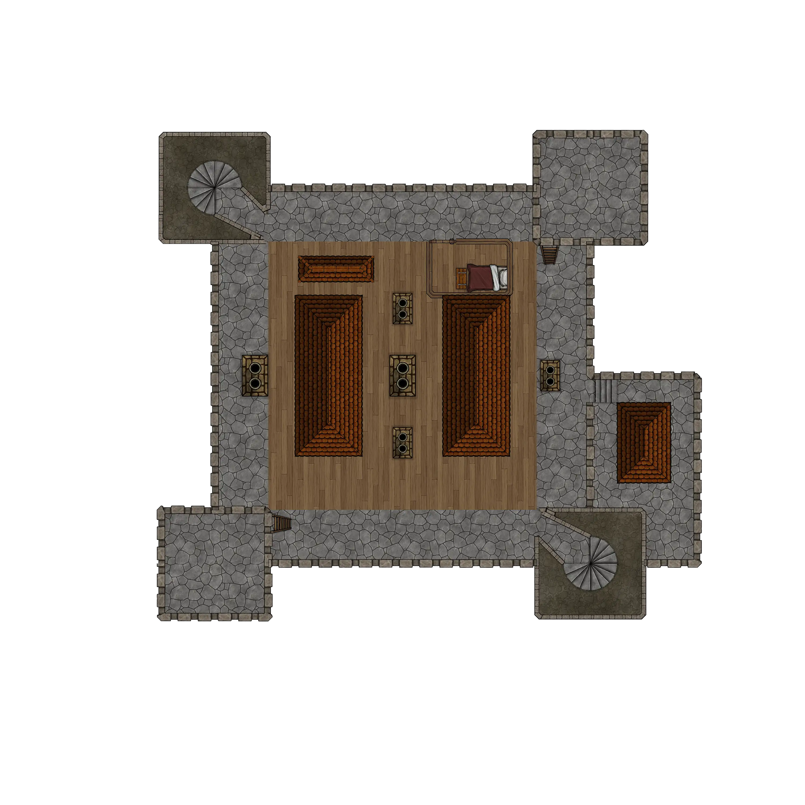

# HârnWorld Location Module: Getha Keep

Getha Keep is a "Location Module" for the Foundry VTT system. This location module
is designed to depict the Getha Keep in the far northeast of the Kingdom of Kaldor, on
the island of Hârn in the [HârnWorld](https://columbiagames.com/harnworld/) fantasy
setting; however, this manor could be adapted to exist anywhere in any fantasy setting.

Although designed for use with the [HârnMaster](https://foundryvtt.com/packages/hm3)
system, this module is mostly system-agnostic.  Detailed descriptions of the actors
has been provided in journal entries to facilitate conversion to other game systems.

Getha is the largest village in Fethael Hundred. The seat and ancestral home of the
Indama clan, this village also provides goods and services to Silver Way caravans
and travelers.

# Maps

The original maps from this work have been used as inspiration, and new maps have been
designed specifically to meet the requirements of the VTT environment.  The following
maps are part of this module.

## Getha Village

Map of Getha Village, including the keep.

## Gatehouse Inn

Cellar.

Ground floor.

Upper floor.

## Leaky Bucket Inn

Cellar.

Ground floor.

Upper floor.

## Temple of Halea

Ground floor.

Second floor.

Third floor.

## Getha Keep

Cellar (Ground Level).

Entry floor.

Main hall floor.

Residence floor.

Roof and Towers.

# Credits

This module is made possible by the hard work of HârnWorld fans,
and is provided at no cost. This work is an adaptation of the article
[Getha Keep](https://www.lythia.com/harnworld/settlements/getha-keep/) available
at the HârnWorld fan site [Lythia.com](https://www.lythia.com/).

**Writer:** Joe Adams

**Original Maps:** George Kelln

**Contributor:** Robert Barfield

**Heraldry:** Matthias Janssen

**With Thanks To:** Dan Bell &amp; John Sgammato

**Adapted to Foundry VTT:** Tom Rodriguez

This module is "[Fanon](https://www.lythia.com/about/publishing-fan-written-material/)",
a derivative work of copyrighted material by Columbia Games Inc. and N. Robin Crossby.

Some assets used to create the maps in this module are from
[Forgotton Adventures](https://www.forgotten-adventures.net/).
